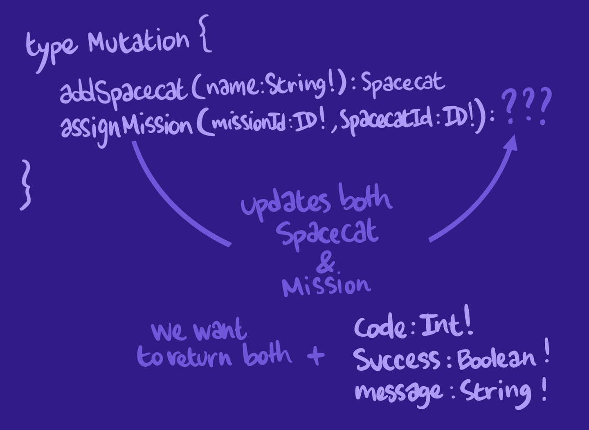

# Odyssey Lift-off IV: Mutations

Welcome to the companion app of Odyssey Lift-off IV! You can [find the course lessons and instructions on Odyssey](https://odyssey.apollographql.com/lift-off-part4), Apollo's learning platform.

You can [preview the completed demo app here](https://lift-off-client-demo.netlify.app/).

## How to use this repo

The course will walk you step by step on how to implement the features you see in the demo app. This codebase is the starting point of your journey!

There are 3 main folders:

- `server`: The starting point of our GraphQL server.
- `client`: The starting point of our React application.
- `final`: The final stage of both the server and client folders, with all of the steps and code completed!

To get started:

1. Navigate to the `server` folder.
1. Run `npm install`.
1. Run `npm start`.

This will start the GraphQL API server.

In another Terminal window,

1. Navigate to the `client` folder.
1. Run `npm install`.
1. Run `npm start`.

This will open up `localhost:3000` in your web browser.

## Getting Help

For any issues or problems concerning the course content, please refer to the [Odyssey topic in our community forums](https://community.apollographql.com/tags/c/help/6/odyssey).

## Toby's Notes

### Mutations
1 - To modify data, we need to use another type of GraphQL operation: mutations, which are write operations.
2 - syntax: It follows the same syntax as the schema definition language, or SDL, that we've been using so far.
3 - modify multiple objects (for example 2 objects, SpaceCat and Mission): We'll want to return both, because our client might need both. In addition,  we shall also return 3 common fields (code: int, success: boolean, message: str)

